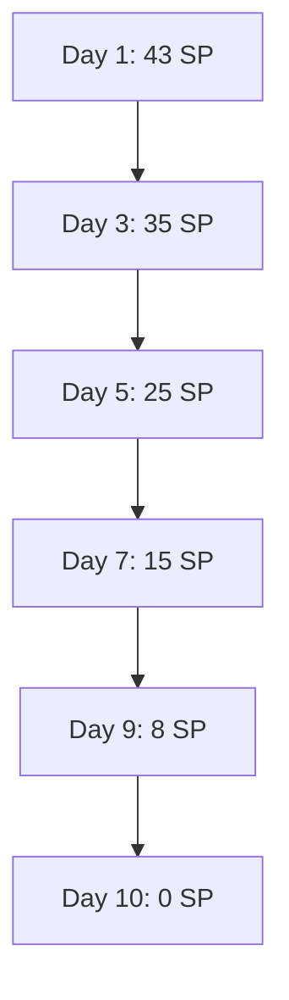

# DIGITÁLIS KULTÚRA VERSENY - SPRINT-TERVEZÉS 2025 Q1

## 📋 Sprint Tervezési Dokumentum

### Projekt Információk
- **Projekt neve**: Digitális Kultúra Verseny
- **Sprint időszak**: 2025. január 15. - 2025. március 31. (11 hét)
- **Sprint hossz**: 2 hét
- **Sprint számozás**: Sprint 1-5
- **Dátum**: 2025-12-21
- **Scrum Master**: [TBD]

---

## 🎯 SPRINT CÉLOK ÉS STRATÉGIA

### Sprint 1 Cél (Jan 15-31)
**"MVP Alap Infrastruktúra"**
- GitHub repository és CI/CD pipeline beállítása
- SEL architektúra alapok implementálása
- Hub navigációs rendszer létrehozása
- Alapvető UI komponensek fejlesztése

### Sprint 2 Cél (Feb 1-14)
**"Video Player és 3. Osztály Prototípus"**
- HTML5 Video API integráció
- Audio synchronization rendszer
- 3. osztály prototípus videók betöltése
- Alapvető rejtvény engine

### Sprint 3 Cél (Feb 15-28)
**"Rejtvény Engine és Pontszámítás"**
- 8+ rejtvény típus implementálása
- Pontszámítás rendszer fejlesztése
- LocalStorage mentési rendszer
- Progress tracking

### Sprint 4 Cél (Mar 1-14)
**"3. Osztály Teljes Tartalom"**
- Összes 3. osztály állomás implementálása
- Teljes "Kód Királyság Titka" történet
- Admin dashboard alapok
- Cross-browser testing

### Sprint 5 Cél (Mar 15-31)
**"Beta Release és Pilot Preparation"**
- Teljes 3. osztály beta verzió
- Performance optimalizálás
- Beta tesztelés előkészítése
- Pilot iskola kapcsolatfelvétel

---

## 📋 SPRINT BACKLOG

### Sprint 1 - Infrastruktúra és Alapok

#### Epic 1: Development Environment Setup
**Prioritás**: KRITIKUS

##### Sprint 1.1: Repository és CI/CD
- [ ] **Task 1.1.1**: GitHub repository létrehozása
  - Story Point: 3
  - Felelős: Lead Frontend Developer
  - Becsült idő: 4 óra

- [ ] **Task 1.1.2**: CI/CD pipeline beállítása (GitHub Actions)
  - Story Point: 5
  - Felelős: Lead Frontend Developer
  - Becsült idő: 8 óra

- [ ] **Task 1.1.3**: Branching strategy és git workflow
  - Story Point: 2
  - Felelős: Lead Frontend Developer
  - Becsült idő: 2 óra

##### Sprint 1.2: Project Structure
- [ ] **Task 1.2.1**: Alapvető mappa struktúra létrehozása
  - Story Point: 3
  - Felelős: Frontend Developer
  - Becsült idő: 3 óra

- [ ] **Task 1.2.2**: Package.json és build scriptek
  - Story Point: 2
  - Felelős: Frontend Developer
  - Becsült idő: 2 óra

- [ ] **Task 1.2.3**: Code standards konfigurálása (ESLint, Prettier)
  - Story Point: 2
  - Felelős: Frontend Developer
  - Becsült idő: 2 óra

#### Epic 2: SEL Architecture Implementation
**Prioritás**: MAGAS

##### Sprint 2.1: Core Modules
- [ ] **Task 2.1.1**: State Manager implementálása
  - Story Point: 5
  - Felelős: Lead Frontend Developer
  - Becsült idő: 6 óra

- [ ] **Task 2.1.2**: EventBus rendszer létrehozása
  - Story Point: 3
  - Felelős: Lead Frontend Developer
  - Becsült idő: 4 óra

- [ ] **Task 2.1.3**: Logger system implementálása
  - Story Point: 3
  - Felelős: Lead Frontend Developer
  - Becsült idő: 3 óra

##### Sprint 2.2: Storage és Configuration
- [ ] **Task 2.2.1**: LocalStorage wrapper fejlesztése
  - Story Point: 3
  - Felelős: Frontend Developer
  - Becsült idő: 4 óra

- [ ] **Task 2.2.2**: Configuration Manager
  - Story Point: 2
  - Felelős: Frontend Developer
  - Becsült idő: 3 óra

#### Epic 3: UI Framework és Hub
**Prioritás**: MAGAS

##### Sprint 3.1: Base UI Components
- [ ] **Task 3.1.1**: CSS Design System és variables
  - Story Point: 3
  - Felelős: UI/UX Designer + Frontend Developer
  - Becsült idő: 4 óra

- [ ] **Task 3.1.2**: Alapvető UI komponensek (Button, Card, Modal)
  - Story Point: 5
  - Felelős: Frontend Developer
  - Becsült idő: 6 óra

##### Sprint 3.2: Hub Navigation
- [ ] **Task 3.2.1**: Hub főoldal implementálása
  - Story Point: 5
  - Felelős: Frontend Developer
  - Becsült idő: 8 óra

- [ ] **Task 3.2.2**: Évfolyam választó felület
  - Story Point: 3
  - Felelős: Frontend Developer
  - Becsült idő: 4 óra

- [ ] **Task 3.2.3**: Progress indicator komponens
  - Story Point: 2
  - Felelős: Frontend Developer
  - Becsült idő: 3 óra

**Sprint 1 Összesen: 43 Story Point**

---

### Sprint 2 - Video Player és Prototípus

#### Epic 4: Video Player Implementation
**Prioritás**: KRITIKUS

##### Sprint 4.1: Video API Integration
- [ ] **Task 4.1.1**: HTML5 Video API wrapper
  - Story Point: 5
  - Felelős: Lead Frontend Developer
  - Becsült idő: 6 óra

- [ ] **Task 4.1.2**: Video kontrollerek (play, pause, stop, volume)
  - Story Point: 3
  - Felelős: Frontend Developer
  - Becsült idő: 4 óra

- [ ] **Task 4.1.3**: Video progress tracking
  - Story Point: 2
  - Felelős: Frontend Developer
  - Becsült idő: 3 óra

##### Sprint 4.2: Audio Synchronization
- [ ] **Task 4.2.1**: Web Audio API integráció
  - Story Point: 5
  - Felelős: Lead Frontend Developer
  - Becsült idő: 8 óra

- [ ] **Task 4.2.2**: Audio-Video szinkronizálás
  - Story Point: 3
  - Felelős: Lead Frontend Developer
  - Becsült idő: 5 óra

#### Epic 5: 3. Osztály Prototípus
**Prioritás**: MAGAS

##### Sprint 5.1: Video Content Integration
- [ ] **Task 5.1.1**: Intro videó integráció
  - Story Point: 3
  - Felelős: Frontend Developer
  - Becsült idő: 4 óra

- [ ] **Task 5.1.2**: Első állomás videó és navigáció
  - Story Point: 5
  - Felelős: Frontend Developer
  - Becsült idő: 6 óra

- [ ] **Task 5.1.3**: Video fallback és error handling
  - Story Point: 2
  - Felelős: Frontend Developer
  - Becsült idő: 3 óra

**Sprint 2 Összesen: 28 Story Point**

---

### Sprint 3 - Rejtvény Engine

#### Epic 6: Rejtvény Engine Development
**Prioritás**: KRITIKUS

##### Sprint 6.1: Base Puzzle Engine
- [ ] **Task 6.1.1**: Puzzle Manager implementálása
  - Story Point: 5
  - Felelős: Lead Frontend Developer
  - Becsült idő: 8 óra

- [ ] **Task 6.1.2**: Puzzle interface és validation
  - Story Point: 3
  - Felelős: Frontend Developer
  - Becsült idő: 4 óra

##### Sprint 6.2: Puzzle Types Implementation
- [ ] **Task 6.2.1**: Szöveges kérdések (Multiple Choice)
  - Story Point: 3
  - Felelős: Frontend Developer
  - Becsült idő: 4 óra

- [ ] **Task 6.2.2**: Vizuális puzzle (Image-based)
  - Story Point: 5
  - Felelős: Frontend Developer
  - Becsült idő: 6 óra

- [ ] **Task 6.2.3**: Kódolási feladatok (Basic Coding)
  - Story Point: 8
  - Felelős: Lead Frontend Developer
  - Becsült idő: 10 óra

#### Epic 7: Scoring System
**Prioritás**: MAGAS

##### Sprint 7.1: Score Calculation
- [ ] **Task 7.1.1**: Pontszámítás algoritmus
  - Story Point: 3
  - Felelős: Frontend Developer
  - Becsült idő: 4 óra

- [ ] **Task 7.1.2**: Bónusz pontok rendszer
  - Story Point: 2
  - Felelős: Frontend Developer
  - Becsült idő: 3 óra

- [ ] **Task 7.1.3**: Score display és feedback
  - Story Point: 2
  - Felelős: Frontend Developer
  - Becsült idő: 3 óra

**Sprint 3 Összesen: 31 Story Point**

---

### Sprint 4 - 3. Osztály Teljes Tartalom

#### Epic 8: 3. Osztály Complete Implementation
**Prioritás**: KRITIKUS

##### Sprint 8.1: All Stations Implementation
- [ ] **Task 8.1.1**: Tudás Torony állomás (2. állomás)
  - Story Point: 5
  - Felelős: Frontend Developer
  - Becsült idő: 6 óra

- [ ] **Task 8.1.2**: Pixel Palota állomás (3. állomás)
  - Story Point: 5
  - Felelős: Frontend Developer
  - Becsült idő: 6 óra

- [ ] **Task 8.1.3**: Labirintuskert állomás (4. állomás)
  - Story Point: 5
  - Felelős: Frontend Developer
  - Becsült idő: 6 óra

- [ ] **Task 8.1.4**: Hangerdő állomás (5. állomás)
  - Story Point: 5
  - Felelős: Frontend Developer
  - Becsült idő: 6 óra

- [ ] **Task 8.1.5**: Adat-tenger állomás (6. állomás)
  - Story Point: 5
  - Felelős: Frontend Developer
  - Becsült idő: 6 óra

##### Sprint 8.2: Story Completion
- [ ] **Task 8.2.1**: Nagy Zár végső küzdelem
  - Story Point: 8
  - Felelős: Lead Frontend Developer
  - Becsült idő: 10 óra

- [ ] **Task 8.2.2**: 3. osztály completion flow
  - Story Point: 3
  - Felelős: Frontend Developer
  - Becsült idő: 4 óra

#### Epic 9: Admin Dashboard Basic
**Prioritás**: KÖZEPES

##### Sprint 9.1: Admin Interface
- [ ] **Task 9.1.1**: Admin bejelentkezés
  - Story Point: 3
  - Felelős: Frontend Developer
  - Becsült idő: 4 óra

- [ ] **Task 9.1.2**: Diákok listájának megtekintése
  - Story Point: 5
  - Felelős: Frontend Developer
  - Becsült idő: 6 óra

**Sprint 4 Összesen: 44 Story Point**

---

### Sprint 5 - Beta Release

#### Epic 10: Quality Assurance
**Prioritás**: KRITIKUS

##### Sprint 10.1: Testing és Bug Fixing
- [ ] **Task 10.1.1**: Cross-browser tesztelés
  - Story Point: 5
  - Felelős: QA Tester + Frontend Developer
  - Becsült idő: 8 óra

- [ ] **Task 10.1.2**: Performance optimalizálás
  - Story Point: 3
  - Felelős: Lead Frontend Developer
  - Becsült idő: 5 óra

- [ ] **Task 10.1.3**: Bug javítások és polish
  - Story Point: 8
  - Felelős: Teljes csapat
  - Becsült idő: 12 óra

##### Sprint 10.2: Beta Preparation
- [ ] **Task 10.2.1**: Beta release csomagolás
  - Story Point: 3
  - Felelős: Lead Frontend Developer
  - Becsült idő: 4 óra

- [ ] **Task 10.2.2**: Deployment preparation
  - Story Point: 2
  - Felelős: Lead Frontend Developer
  - Becsült idő: 3 óra

- [ ] **Task 10.2.3**: Pilot iskola kapcsolatfelvétel
  - Story Point: 2
  - Felelős: Project Manager
  - Becsült idő: 4 óra

**Sprint 5 Összesen: 23 Story Point**

**ÖSSZESEN 5 SPRINT: 169 Story Point**

---

## 👥 TEAM ÖSSZEÁLLÍTÁS ÉS SZEREPKÖRÖK

### Core Team

#### Lead Frontend Developer
**Név**: [TBD]
**Tapasztalat**: 3+ év JavaScript, HTML5, CSS3
**Fő felelősségek**:
- SEL architektúra implementálása
- Video player és audio sync rendszer
- Komplex rejtvény engine fejlesztés
- Code review és mentoring
- Technical decisions
**Időráfordítás**: 40 óra/hét
**Óradíj**: 15.000 Ft

#### Frontend Developer
**Név**: [TBD]
**Tapasztalat**: 1-3 év webfejlesztés
**Fő felelősségek**:
- UI komponensek fejlesztése
- Rejtvény típusok implementálása
- Testing és bug fixing
- Hub navigáció és progress tracking
**Időráfordítás**: 40 óra/hét
**Óradíj**: 12.000 Ft

#### UI/UX Designer
**Név**: [TBD]
**Tapasztalat**: 2+ év education/children apps
**Fő felelősségek**:
- Visual design system
- User experience design
- Prototyping és design implementation guide
- Children-friendly interface design
**Időráfordítás**: 20 óra/hét
**Óradíj**: 12.000 Ft

#### Project Manager
**Név**: [TBD]
**Tapasztalat**: 2+ év software project management
**Fő felelősségek**:
- Projekt koordináció és timeline management
- Stakeholder kommunikáció
- Quality assurance
- Pilot program koordináció
**Időráfordítás**: 15 óra/hét
**Óradíj**: 10.000 Ft

### Supporting Team

#### Video Content Creator (Opcionális)
**Felelősség**: Video tartalmak készítése
**Időráfordítás**: 30-50 óra összesen
**Óradíj**: 8.000 Ft

#### QA Tester (Peak periods)
**Felelősség**: Tesztelés és minőségbiztosítás
**Időráfordítás**: 20 óra/hét (Sprint 4-5)
**Óradíj**: 10.000 Ft

---

## 🛠️ TECHNICAL INFRASTRUKTÚRA

### Fejlesztői Környezet

#### Alapvető Követelmények
```bash
- Node.js: 18.0.0 vagy újabb
- npm: 8.0.0 vagy újabb
- Git: 2.30.0 vagy újabb
- VS Code + Extensions:
  * ESLint
  * Prettier
  * Live Server
  * HTML CSS Support
  * JavaScript (ES6) code snippets
```

#### Build és Deployment Pipeline
```yaml
CI/CD: GitHub Actions
Testing: Jest + Cypress
Build: Rollup (minimális bundler)
Deployment: Static hosting (Netlify/GitHub Pages)
Monitoring: Basic error tracking
```

### Technológiai Stack (Döntött)
```javascript
Frontend:
  - HTML5 (Semantic markup + Video API)
  - CSS3 (Flexbox, Grid, Custom Properties)
  - JavaScript ES6+ (Vanilla JS)
  - Architecture: SEL (State-Eventbus-Logger)
  - Storage: LocalStorage API
  - Video: HTML5 Video + Web Audio API
```

### Projekt Struktúra
```
digitális-kultúra-verseny/
├── src/
│   ├── core/                     # SEL Architecture
│   │   ├── state/                # State management
│   │   ├── events/               # Event system
│   │   └── logging/              # Logger system
│   ├── features/                 # Funkcionális modulok
│   │   ├── authentication/       # Regisztráció
│   │   ├── video/               # Video player
│   │   ├── puzzles/             # Rejtvények
│   │   ├── navigation/          # Navigáció
│   │   └── scoring/             # Pontszámítás
│   └── ui/                      # Felhasználói interfész
│       ├── components/          # UI komponensek
│       ├── styles/             # CSS fájlok
│       └── assets/             # Statikus fájlok
├── tests/                       # Tesztek
├── docs/                       # Dokumentáció
├── videos/                     # Video tartalmak
└── dist/                       # Build kimenet
```

---

## ⚠️ KOCKÁZATOK ÉS MITIGÁCIÓK

### Technikai Kockázatok

#### Video Streaming Problémák
**Kockázat**: Videók nem töltődnek be vagy akadoznak
**Valószínűség**: Közepes
**Hatás**: Magas
**Mitigáció**:
- CDN használat video hosting-hoz
- Multiple format támogatás (MP4, WebM)
- Fallback mechanizmusok
- Offline cache kritikus videókhoz

#### Cross-browser Inkompatibilitás
**Kockázat**: Funkciók nem működnek minden böngészőben
**Valószínűség**: Közepes
**Hatás**: Közepes
**Mitigáció**:
- Extensive cross-browser testing
- Progressive enhancement megközelítés
- Fallback solutions alternatív böngészőkhöz

### Projekt Kockázatok

#### Csapat Összeállítás
**Kockázat**: Nem találunk megfelelő fejlesztőket
**Valószínűség**: Alacsony
**Hatás**: Magas
**Mitigáció**:
- Korai csapat toborzás
- Freelancer pool kialakítása
- Outsourcing opciók előkészítése

#### Időkeret Túllépés
**Kockázat**: Fejlesztés késik a tervezettől
**Valószínűség**: Közepes
**Hatás**: Magas
**Mitigáció**:
- MVP-first megközelítés
- Phased development
- Buffer time tervezése (20%)
- Scope adjustment lehetőség

### Üzleti Kockázatok

#### Finanszírozás Hiánya
**Kockázat**: Nem elég forrás a projekt befejezéséhez
**Valószínűség**: Alacsony
**Hatás**: Magas
**Mitigáció**:
- Phased development approach
- MVP (Minimum Viable Product) prioritizálás
- Multiple funding source keresés

---

## 📊 METRIKÁK ÉS MÉRFÖLDKÖVEK

### Sprint Metrikák

#### Velocity Tracking
**Cél velocity**: 30-35 Story Point per sprint
**Mérés**: Sprint végén
**Tracking**: Burndown chart

#### Quality Metrics
**Code coverage**: >70%
**Cross-browser compatibility**: 95%+
**Performance**: Page load <3s
**Bug count**: <5 critical per sprint

#### Team Metrics
**Team satisfaction**: >4/5
**Communication effectiveness**: Daily standup attendance >95%
**Blocker resolution**: <24 hours

### Sprint Mérföldkövek

#### Sprint 1 Végén (Jan 31)
- [ ] GitHub repository és CI/CD működik
- [ ] SEL architektúra alapok implementálva
- [ ] Hub navigáció alapverzió kész
- [ ] Team velocity established

#### Sprint 2 Végén (Feb 14)
- [ ] Video player működik minden böngészőben
- [ ] 3. osztály prototípus játszható
- [ ] Audio-Video szinkronizálás stabil
- [ ] Alapvető rejtvény engine működik

#### Sprint 3 Végén (Feb 28)
- [ ] Mind a 8 rejtvény típus implementálva
- [ ] Pontszámítás rendszer működik
- [ ] LocalStorage mentés stabil
- [ ] Progress tracking kész

#### Sprint 4 Végén (Mar 14)
- [ ] Teljes 3. osztály story implementálva
- [ ] Admin dashboard alapok kész
- [ ] Cross-browser testing completed
- [ ] Beta verzióra kész

#### Sprint 5 Végén (Mar 31)
- [ ] Beta release elkészült
- [ ] Performance optimalizálva
- [ ] Pilot iskola kapcsolatfelvétel megtörtént
- [ ] Production-ready alapok

### Projekt Mérföldkövek

#### MVP Alpha (Feb 15)
- Alap játékmenet működik
- Video lejátszás stabil
- 3. osztály prototípus

#### 3. Osztály Beta (Mar 31)
- Teljes 3. osztály tartalom
- Minden rejtvény típus működik
- Pontszámítás rendszer
- LocalStorage mentés

#### Production Ready (Apr 15)
- Teljes 3. osztály stabil
- Admin dashboard
- Cross-browser kompatibilitás
- Pilot launch előkészítés

---

## 📈 SPRINT BURNDOWN CHART ÉS TRACKING

### Sprint Planning Tracking

#### Sprint 1 Burndown Célok
**Total Story Points**: 43
**Daily Expected Completion**: 4-5 SP
**Sprint Goal**: Infrastructure setup



#### Velocity Tracking
**Sprint 1 Cél**: 35-40 SP (realistic start)
**Sprint 2 Cél**: 30-35 SP
**Sprint 3 Cél**: 30-35 SP
**Sprint 4 Cél**: 35-40 SP (sprint to completion)
**Sprint 5 Cél**: 25-30 SP (stabilization)

### Definition of Done (DoD)

#### Technikai DoD
- [ ] Code kompilál és fut
- [ ] Unit tesztek írva és futnak
- [ ] Code review completed
- [ ] Documentation updated
- [ ] Cross-browser tested
- [ ] Performance benchmark met

#### Funkcionális DoD
- [ ] User story minden kritériuma teljesítve
- [ ] Integration tesztek futnak
- [ ] Manual testing completed
- [ ] Accessibility requirements met
- [ ] Mobile responsive (768px+)

---

## 🔄 SPRINT REVIEW ÉS RETROSPECTIVE TERVEZÉS

### Sprint Review Agenda (1 óra)

#### Sprint 1 Review (Jan 31)
**Idő**: 14:00-15:00
**Résztvevők**: Teljes csapat + Stakeholderek

**Agenda**:
1. **Sprint demo** (30 perc)
   - GitHub repository bemutatása
   - CI/CD pipeline demonstration
   - SEL architektúra overview
   - Hub navigáció demo

2. **Review és feedback** (20 perc)
   - Stakeholder feedback
   - Technical review
   - Scope adjustment讨论

3. **Next sprint planning** (10 perc)
   - Sprint 2 goals confirmation
   - Resource allocation

#### Sprint 2-5 Review Structure
**Standard agenda** (1 óra):
- Demo: 40 perc
- Review: 15 perc
- Planning: 5 perc

### Sprint Retrospective Agenda (1 óra)

#### Standard Retrospective Format

**What went well?**
- Technical achievements
- Team collaboration
- Process improvements

**What could be improved?**
- Communication issues
- Technical challenges
- Process bottlenecks

**Action items for next sprint**
- Specific, measurable improvements
- Owner assignment
- Due date

### Continuous Improvement

#### Sprint-by-Sprint Metrics
- **Team velocity trend**
- **Bug introduction rate**
- **Code review turnaround time**
- **Stakeholder satisfaction**

#### Process Adjustments
- **Week 2**: Adjust story point estimation based on velocity
- **Week 4**: Review DoD effectiveness
- **Week 6**: Evaluate team communication tools
- **Week 8**: Assess technical debt accumulation
- **Week 10**: Final process optimization before beta

---

## 💰 KÖLTSÉGVETÉS ÉS ERŐFORRÁSOK

### Sprint Költségvetés (5 Sprint)

#### Emberi Erőforrások
```
Lead Frontend Developer: 550 óra × 15.000 Ft = 8.250.000 Ft
Frontend Developer: 550 óra × 12.000 Ft = 6.600.000 Ft
UI/UX Designer: 275 óra × 12.000 Ft = 3.300.000 Ft
Project Manager: 165 óra × 10.000 Ft = 1.650.000 Ft

Összes emberi költség: 19.800.000 Ft
```

#### Technológiai Költségek
```
Development tools: 100.000 Ft
Video hosting setup: 150.000 Ft
Domain + SSL: 35.000 Ft/év
CDN szolgáltatás: 100.000 Ft (6 hónap)

Összes technológiai költség: 385.000 Ft
```

### ROI Projekció

#### Q1 Investment: 20.185.000 Ft
#### Expected Q2-Q3 Revenue:
- 5 pilot iskola × 200.000 Ft = 1.000.000 Ft
- 100 premium diák × 3.000 Ft = 300.000 Ft

**Break-even**: 2026 Q1 (assuming expansion)

---

## 📞 KAPCSOLATTARTÁS ÉS KOMMUNIKÁCIÓ

### Napi Kommunikáció

#### Daily Standup (15 perc, 09:00)
**Platform**: Microsoft Teams / Slack
**Résztvevők**: Teljes fejlesztői csapat

**Standard kérdések**:
1. Mit csináltál tegnap?
2. Mit fogsz csinálni ma?
3. Milyen akadályokba ütköztél?

### Sprint Ceremonies

#### Sprint Planning (2 óra, hétfő 10:00)
**Résztvevők**: Teljes csapat
**Cél**: Sprint backlog finalizálása

#### Sprint Review (1 óra, péntek 14:00)
**Résztvevők**: Csapat + Stakeholderek
**Cél**: Sprint eredmények bemutatása

#### Sprint Retrospective (1 óra, péntek 15:00)
**Résztvevők**: Teljes csapat
**Cél**: Folyamatos fejlesztés

### Dokumentáció

#### Repository Documentation
- **README.md**: Projekt áttekintés
- **CONTRIBUTING.md**: Fejlesztői guide
- **ARCHITECTURE.md**: Technikai architektúra
- **API.md**: API dokumentáció

#### Project Management
- **GitHub Projects**: Sprint tracking
- **GitHub Issues**: Bug tracking
- **GitHub Wiki**: Comprehensive documentation

---

## 🚀 KÖVETKEZŐ LÉPÉSEK

### Azonnali Teendők (Ezen a héten)
1. **Csapat összeállítás**
   - Lead Frontend Developer felvétele
   - Project Manager kijelölése
   - UI/UX Designer szerződtetése

2. **Infrastruktúra setup**
   - GitHub repository létrehozása
   - CI/CD pipeline beállítása
   - Development environment

3. **Sprint 1 indítás**
   - Team kick-off meeting
   - First sprint planning
   - Story point estimation

### Kritikus Döntési Pontok

#### Sprint 1 Végén (Jan 31)
**Döntés**: Architecture Review
- Core architecture működik-e?
- Team velocity established?
- Technical risks identified?

#### Sprint 2 Végén (Feb 14)
**Döntés**: Video Player Go/No-Go
- Video streaming stabil?
- Performance benchmarks met?
- Cross-browser compatibility?

#### Sprint 4 Végén (Mar 14)
**Döntés**: Beta Release Decision
- 3. osztály complete?
- Quality standards met?
- Pilot readiness?

---

## 📋 ÖSSZEGZÉS

Ez a sprint-tervezési dokumentum a **Digitális Kultúra Verseny** projekt **5 sprintes** (11 hetes) fejlesztési tervét tartalmazza, amelynek célja egy működő **MVP beta verzió** elkészítése 2025. március 31-ig.

### Kulcs Sikerfaktorok:
1. **Csapat összeállítás** - Megfelelő szakértelemmel rendelkező fejlesztők
2. **Technikai kiválóság** - Modern web technológiák és best practices
3. **Minőségi fókusz** - Thorough testing és performance optimalizálás
4. **Felhasználó-központú design** - Gyerekbarát interface design
5. **Agile végrehajtás** - Flexible fejlesztés és gyors iterációk

### Várható Kimenet:
- **MVP Beta**: Teljes 3. osztály játékmenet
- **Admin alapok**: Tanár dashboard és eredmény tracking
- **Pilot ready**: Első iskolákban való tesztelésre kész
- **Production foundation**: Teljes termék alapjai

### Következő Sprint:
**Sprint 1 indítás**: 2025. január 15.
**Első mérföldkő**: GitHub repository és CI/CD pipeline működik
**Kritikus döntés**: Architecture review január 31-én

---

*Dokumentum verzió: 1.0*  
*Dátum: 2025-12-21*  
*Scrum Master: [TBD]*  
*Project Manager: [TBD]*