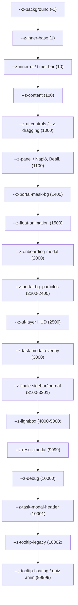

# Z-index Hierarchia Térkép

> **Forrás:** `src/ui/styles/z-index.css` – ez a fájl tartalmazza az összes változót.  
> **Használat:** `var(--z-<nev>)` a CSS-ben.

## Rétegek – Növekvő Sorrendben

| CSS változó | Érték | Leírás | Érintett fájlok |
|---|---|---|---|
| `--z-background` | **-1** | Háttér blur/overlay mögöttes réteg | `design-system.css` |
| `--z-inner-base` | **1** | Task modal body (grid réteg belül) | `design-system.css` |
| `--z-inner-secondary` | **2** | Memory kártya hátlap, grade overlay | `Memory.css`, `main.css` (grade4-6) |
| `--z-inner-elements` | **5** | Summary belső elem | `Summary.css` |
| `--z-inner-top` | **6** | Summary legfelső belső elem | `Summary.css` |
| `--z-inner-ui` | **10** | Timer bar-ok (puzzle, sound, memory) | `Puzzle.css`, `Sound.css`, `Memory.css`, `Quiz.css`, `FinaleGame.css` |
| `--z-content` | **100** | Content Layer, inventory slot overlay | `main.js`, `design-system.css`, `main.css` (grade4-6) |
| `--z-ui-controls` | **1000** | UI Layer, billentyűzet megjelenítő | `main.js`, `design-system.css` |
| `--z-dragging` | **1000** | Húzott puzzle darab (aktív drag) | `Puzzle.css` (!important) |
| `--z-panel` | **1100** | Napló, Beállítások, Narráció panelek | `design-system.css` |
| `--z-portal-mask-bg` | **1400** | Portal maskContainer háttér | `Portal.css` |
| `--z-float-animation` | **1500** | KeyCollectionAnimation, floating points | `design-system.css` |
| `--z-onboarding-modal` | **2000** | Regisztráció és Karakterválasztás modal | `design-system.css`, `Character.css` (grade4-6) |
| `--z-portal-bg` | **2200** | Portal canvas alap réteg | `Portal.css` |
| `--z-portal-vortex` | **2201** | Portal örvény réteg | `Portal.css` |
| `--z-portal-shader` | **2300** | Portal shader layer | `Portal.css` |
| `--z-portal-particles` | **2400** | Portal Three.js részecskék | `Portal.css` |
| `--z-ui-layer` | **2500** | HUD feletti UI réteg (`#dkv-layer-ui`) | `design-system.css` |
| `--z-task-modal-overlay` | **3000** | Feladat modal overlay (`.dkv-task-modal-overlay`) | `design-system.css` |
| `--z-finale-sidebar` | **3100** | Finale alatt kiemelkedő oldalsáv | `FinaleGame.css` |
| `--z-finale-journal` | **3200** | Finale felett megjelenő napló panel | `FinaleGame.css` |
| `--z-finale-journal-btn` | **3201** | Finale napló gombja (panel felett) | `FinaleGame.css` |
| `--z-lightbox-overlay` | **4000** | Inventory kulcs nagyítás háttér overlay | `FinaleGame.css` |
| `--z-lightbox` | **5000** | Inventory kulcs nagyított képe | `design-system.css` |
| `--z-result-modal` | **9999** | Feladat összegző eredmény modal | `design-system.css`, `debug.css`, `Registration.css` (grade4-6) |
| `--z-debug` | **10000** | Debug Panel – csak DEV módban | `debug.css` |
| `--z-task-modal-header` | **10001** | Feladat modal fejléce (tooltip szülője) | `design-system.css` |
| `--z-tooltip-legacy` | **10002** | Régi CSS-alapú tooltip content | `design-system.css` |
| `--z-quiz-floating-pt` | **99999** | Quiz +pont lebegő animáció (ideiglenes) | `Quiz.css` |
| `--z-tooltip-floating` | **99999** | Floating Súgó panel (`document.body`-ban) | `design-system.css` |

## Mermaid Diagram

## Fontos Szabályok

1. **Új értéket SOHA ne hardcode-olj** – mindig vegyél fel változót ebbe a fájlba.
2. **A `!important` z-index csak végső megoldás** (pl. dragging) – kerüld.
3. **A floating tooltip (`--z-tooltip-floating`) a legmagasabb** – minden játékelem felette van.
4. **A portál rétegek (2200–2400) a UI-layer (2500) alatt vannak** – szándékos.
5. **A Finale saját rétegei (3100–3201) a task modal overlay (3000) fölött** – szándékos, hogy a napló látsszon a feladat modal fölött.
